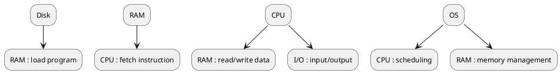
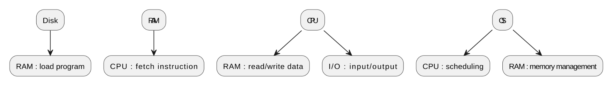
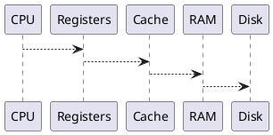
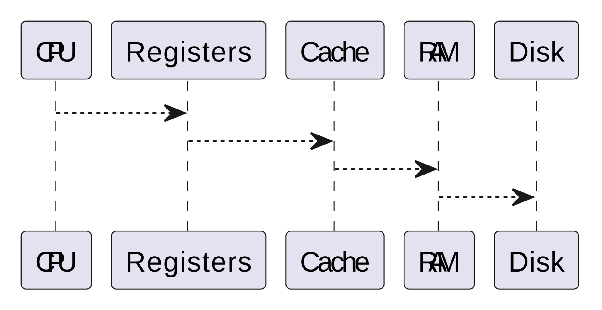
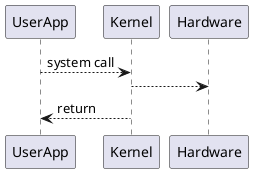
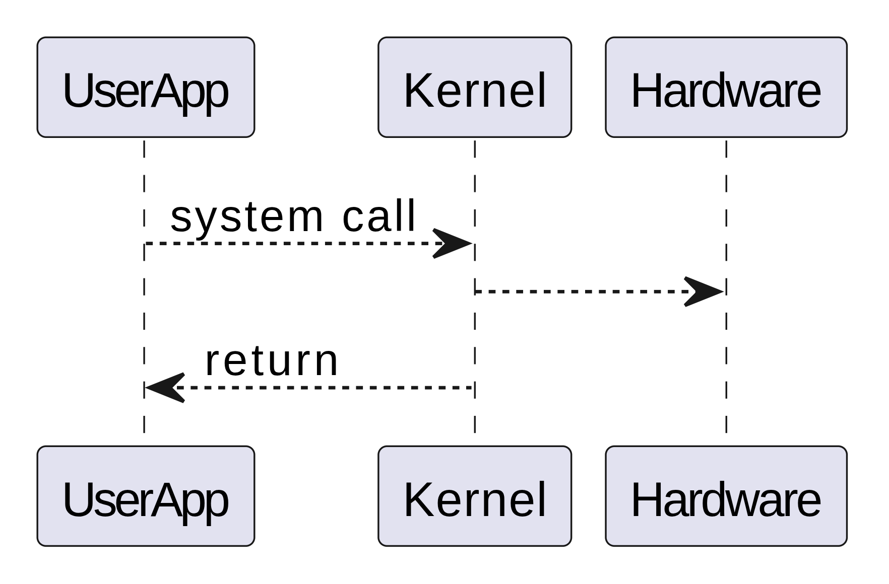

# How Computers Work

## Overview

A computer is a general-purpose machine designed to **execute instructions on data**. At its core, it transforms inputs into outputs by following a precise sequence of steps defined by programs.

This topic exists to answer foundational questions:

* What *actually* happens when a program runs?
* How does software control hardware?
* How do simple electrical signals become complex applications?

Understanding how computers work solves a critical problem for engineers: **mental models**. Without a correct mental model, debugging, performance tuning, system design, and learning advanced topics (OS, networking, compilers) become guesswork.

---

## Core Concepts

### 1. Hardware vs Software

* **Hardware**: Physical components (CPU, memory, disk, motherboard).
* **Software**: Instructions (programs) that tell hardware what to do.

Hardware is *passive*. Software drives behavior.

---

### 2. Program

A **program** is a sequence of instructions written in a programming language that:

* Accepts input
* Processes data
* Produces output

At the lowest level, all programs become **machine instructions** (binary).

---

### 3. Data

Data is information represented in binary:

* Numbers
* Text
* Images
* Videos

All data is ultimately stored and processed as **bits (0s and 1s)**.

---

### 4. Instruction

An instruction tells the CPU to perform a single operation, such as:

* Load data from memory
* Add two numbers
* Compare values
* Jump to another instruction

---

### 5. CPU (Central Processing Unit)

The CPU is the **brain** of the computer. It repeatedly:

1. Fetches an instruction
2. Decodes it
3. Executes it

This loop is called the **instruction cycle**.

---

### 6. Memory (RAM)

* Temporary storage for:

  * Running programs
  * Active data
* Fast but volatile (data lost on power off)

---

### 7. Storage (Disk / SSD)

* Persistent storage
* Slower than RAM
* Stores OS, programs, and files

---

### 8. Input / Output (I/O)

* Input: keyboard, mouse, network
* Output: screen, speakers, files, network

---

## How It Works Internally

### High-Level Flow

1. Power on computer
2. Firmware (BIOS/UEFI) initializes hardware
3. Operating System is loaded into memory
4. OS waits for user actions
5. User runs a program
6. Program instructions execute on CPU
7. Program reads/writes memory and I/O
8. Program exits, OS regains control

---

### Instruction Execution (CPU View)

The CPU runs a **Fetch–Decode–Execute** cycle:

1. **Fetch**

   * Instruction loaded from memory into CPU
2. **Decode**

   * CPU determines what operation to perform
3. **Execute**

   * Operation is performed (ALU, memory access, jump)

This happens **billions of times per second**.

---

### Memory Interaction

* CPU cannot work directly on disk
* Program must be:

  * Loaded from disk → RAM
  * Executed from RAM → CPU registers
* Registers are the fastest storage, inside CPU

---

### Control Flow

Programs use:

* Sequential execution
* Conditional jumps (`if`)
* Loops
* Function calls

The CPU uses an **instruction pointer** to track the next instruction.

---

### OS Mediation

The Operating System:

* Loads programs
* Allocates memory
* Schedules CPU time
* Handles I/O
* Protects processes from each other

Applications never control hardware directly.

---

## Real-World Analogies

### Computer as a Factory

* **CPU** → Worker
* **Instructions** → Task list
* **RAM** → Workbench
* **Disk** → Warehouse
* **OS** → Factory manager

The worker:

* Picks tasks from the list
* Uses tools on the workbench
* Stores finished goods back in the warehouse

---

### CPU as a Chef

* Recipe = Program
* Ingredients = Data
* Kitchen counter = RAM
* Pantry = Disk
* Head chef = OS

Chef follows instructions exactly, step by step.

---

## Common Variants / Types / Strategies

### Von Neumann Architecture

* Instructions and data share same memory
* Simple, common, flexible
* Potential bottleneck (memory access)

---

### Harvard Architecture

* Separate instruction and data memory
* Faster access
* Used internally in modern CPUs (modified Harvard)

---

### Single-Core vs Multi-Core

* Single-core: one instruction stream at a time
* Multi-core: multiple CPUs executing in parallel

---

## Why It Matters in Real Systems

### Performance

* Understanding memory vs CPU speeds avoids slow designs
* Explains why caching exists

### Reliability

* OS isolation prevents crashes from spreading
* Hardware faults can be reasoned about

### Scalability

* Knowing CPU and memory limits informs system scaling

### Cost

* Overusing resources leads to wasted infrastructure

### Failure Modes

* Infinite loops
* Memory leaks
* CPU starvation
  All trace back to fundamental execution behavior

---

## Common Mistakes & Misconceptions

* ❌ “CPU runs programs directly from disk”
* ❌ “RAM stores data permanently”
* ❌ “More GHz always means faster”
* ❌ “OS is just another app”
* ❌ “Code runs exactly as written” (compilers, OS, hardware reorder things)

---

## Key Takeaways

* Computers execute **instructions on data**
* CPU follows a strict fetch–decode–execute cycle
* Programs must live in **memory** to run
* OS is the mediator between software and hardware
* All abstractions eventually map to hardware behavior
* Strong fundamentals prevent shallow debugging and design mistakes

---

## Diagram

---

---

## 01-What-Is-a-Program

## Overview

A **program** is a precise set of instructions that tells a computer **what to do**, **in what order**, and **on which data**. It exists to convert human intent into machine-executable behavior.

Programs solve the fundamental problem of **automation**: instead of manually performing tasks, we encode logic once and let the machine execute it reliably and repeatedly.

---

## Core Concepts

### Instruction

* The smallest unit of work a computer can perform
* Examples: add, compare, jump, load, store

### Program vs Process

* **Program**: Static set of instructions stored on disk
* **Process**: A running instance of a program in memory

### Source Code → Machine Code

1. Human-readable source code
2. Compiled or interpreted
3. Converted into machine instructions (binary)

### Determinism

* Given the same input and state, a program produces the same output
* Computers do exactly what instructions say—nothing more, nothing less

---

## How It Works Internally

1. Program is stored on disk
2. OS loads program into memory
3. CPU reads instructions sequentially
4. Instruction Pointer tracks execution
5. Control flow alters execution order (loops, branches)

---

## Real-World Analogies

**Program as a Recipe**

* Ingredients = data
* Steps = instructions
* Chef = CPU
* Kitchen = memory

---

## Why It Matters in Real Systems

* Debugging is about understanding instruction flow
* Performance depends on instruction efficiency
* Security exploits target program behavior

---

## Common Mistakes & Misconceptions

* ❌ Program and process are the same
* ❌ Code runs exactly as written (compiler & OS intervene)
* ❌ Programs are intelligent (they are purely mechanical)

---

## Key Takeaways

* Programs are static instruction sets
* Execution requires memory and CPU
* Control flow defines behavior
* Programs have no awareness or intent

---

---

## 02-CPU-and-Memory-Basics

## Overview

The **CPU** and **memory** form the execution core of a computer. The CPU performs operations, while memory stores instructions and data required during execution.

This separation exists because **speed and cost trade-offs** make it impractical for the CPU to store everything internally.

---

## Core Concepts

### CPU

* Executes instructions
* Contains:

  * ALU (Arithmetic Logic Unit)
  * Registers
  * Control Unit

### Registers

* Fastest storage
* Very small
* Directly used by CPU instructions

### RAM (Main Memory)

* Stores:

  * Running programs
  * Active data
* Much faster than disk
* Volatile

### Memory Hierarchy

1. Registers (fastest, smallest)
2. Cache (L1, L2, L3)
3. RAM
4. Disk (slowest, largest)

---

## How It Works Internally

1. CPU fetches instruction from RAM
2. Instruction decoded
3. Data loaded into registers
4. ALU performs operation
5. Result stored back to register or memory

Memory access is often the **performance bottleneck**.

---

## Real-World Analogies

**Desk vs Warehouse**

* Desk = registers
* Room shelves = RAM
* Warehouse = disk

Closer storage = faster access.

---

## Common Variants / Strategies

* Cache coherence in multi-core CPUs
* Prefetching to hide memory latency
* Virtual memory abstraction (handled by OS)

---

## Why It Matters in Real Systems

* Cache misses slow applications
* Memory-heavy apps limit scalability
* CPU idle time wastes resources

---

## Common Mistakes & Misconceptions

* ❌ CPU directly accesses disk
* ❌ RAM is fast enough for everything
* ❌ More cores always means faster

---

## Key Takeaways

* CPU executes, memory stores
* Registers are fastest
* Memory access dominates performance
* Hierarchy exists due to physical limits

---

## Diagram

---

---

## 03-User-Space-vs-Kernel-Space

## Overview

**User space** and **kernel space** are two distinct execution modes that exist to enforce **security, stability, and isolation**.

This separation prevents applications from directly accessing critical system resources.

---

## Core Concepts

### User Space

* Where applications run
* Restricted access
* Cannot directly access hardware

### Kernel Space

* Where OS kernel runs
* Full access to:

  * CPU
  * Memory
  * Devices

### Privilege Levels

* CPU enforces different modes
* Illegal access causes a trap or crash

---

## How It Works Internally

1. Program runs in user mode
2. Needs a privileged operation (file, network)
3. Makes a **system call**
4. CPU switches to kernel mode
5. Kernel performs operation
6. Control returns to user mode

This transition is tightly controlled.

---

## Real-World Analogies

**Airport Security**

* Public area = user space
* Control tower = kernel space
* Only authorized requests allowed inside

---

## Common Variants / Strategies

* Monolithic kernels
* Microkernels
* Hybrid kernels

Each balances performance vs isolation.

---

## Why It Matters in Real Systems

* Prevents malicious code from taking over
* Improves fault isolation
* Enables multi-user systems

---

## Common Mistakes & Misconceptions

* ❌ Applications can access hardware directly
* ❌ Kernel is just another program
* ❌ System calls are free (they’re expensive)

---

## Key Takeaways

* User space is restricted
* Kernel space is privileged
* System calls bridge the gap
* Separation enables secure, stable systems

---

## Diagram

